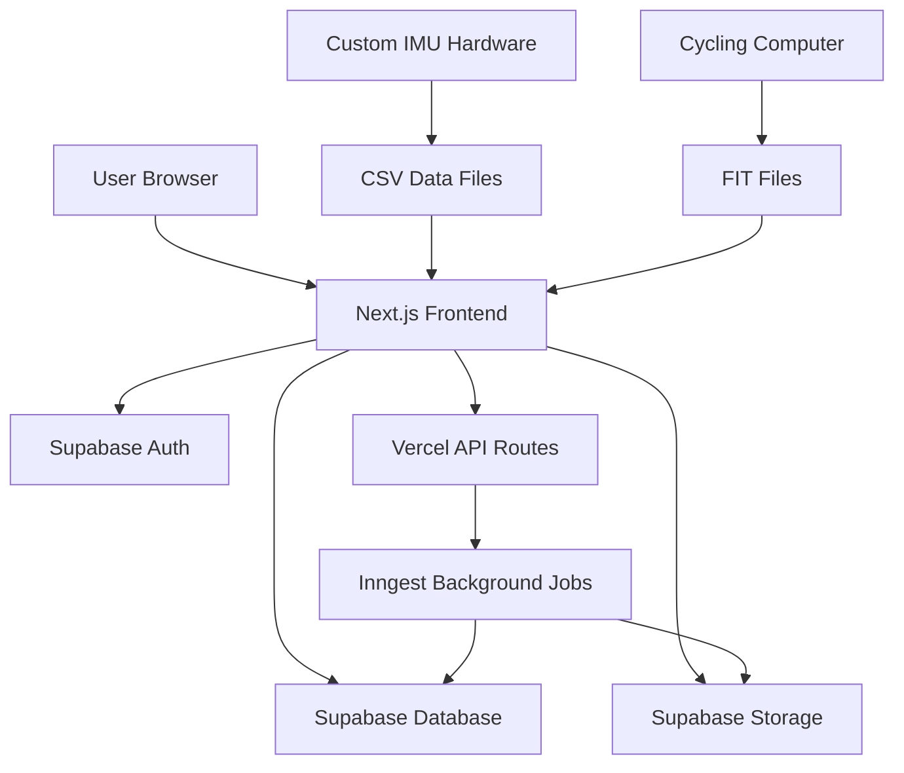

# System Design

## Project Vision

**Vertex** is a web-based platform for uploading, processing, and analyzing IMU cycling data logged from custom hardware. The application enables cyclists to gain detailed insights into their riding dynamics—cornering forces, braking behavior, road surface quality, and pedaling smoothness—by combining high-frequency IMU data with standard cycling computer FIT files.

**Target Scale**: 5-10 queries per second, single user to small team initially, cost-optimized for hobby/prosumer use.

---

## Architecture Overview

### High-Level System Components

### Core Requirements

#### 1. User Authentication
- OAuth 2.0 or better (Google, GitHub, Strava integration desirable)
- Session management and user isolation
- Profile management (name, cycling preferences, bike configurations)

#### 2. Cloud Infrastructure
- Plug-and-play deployment (Vercel, Railway, or similar)
- No manual server management
- Auto-scaling within reasonable limits
- Cost-effective for low-to-moderate traffic

#### 3. Data Upload & Storage
- Multi-file upload UI for CSV IMU logs (30-150 MB per ride typically)
- FIT file upload for cycling computer data (GPS, power, heart rate)
- Raw data storage in database
- File integrity validation

#### 4. Database Architecture
- Raw IMU data storage (time-series optimized)
- Processed ride metadata
- User profiles and associations
- Query performance for large datasets (millions of rows per ride at 50-100Hz)

---

## Technology Stack

### Frontend Framework: **Next.js 14 (App Router)**

**Why:**
- React-based with excellent DX
- Built-in server components for performance
- Native deployment to Vercel (zero-config)
- API routes for backend logic
- File-based routing
- Excellent TypeScript support

**Alternatives Considered:**
- **SvelteKit**: Lighter, faster, but smaller ecosystem
- **Remix**: Good, but more complex deployment
- **Astro**: Better for static sites, less ideal for dynamic apps

### Deployment Platform: **Vercel**

**Why:**
- Native Next.js hosting (made by same company)
- Automatic deployments from Git
- Edge functions for low-latency API routes
- Free tier generous for hobby projects
- Built-in analytics and monitoring
- Serverless architecture (pay-per-use)

**Pricing**:
- Free tier: 100 GB bandwidth, 6000 build minutes/month
- Pro tier: $20/month for production needs
- Edge function pricing: ~$40/million invocations

### Database: **Supabase (PostgreSQL)**

**Why:**
- PostgreSQL with excellent time-series performance
- Built-in authentication and authorization
- Real-time subscriptions
- File storage integration
- Row Level Security (RLS) for multi-tenancy
- Generous free tier

**Alternatives Considered:**
- **PlanetScale**: MySQL-based, good for simple apps
- **Railway PostgreSQL**: Cheaper, but more manual setup
- **TimescaleDB**: Better for pure time-series, but more complex

### Background Processing: **Inngest**

**Why:**
- Reliable job processing with retries
- Type-safe function definitions
- Excellent Next.js integration
- Built-in observability and debugging
- Generous free tier

**Alternatives Considered:**
- **Vercel Cron**: Limited to scheduled jobs
- **Railway Workers**: More manual setup
- **AWS Lambda**: Overkill for this scale

---

## Data Flow Architecture

### Upload Flow
1. **File Upload**: User uploads CSV/FIT files via chunked upload
2. **Validation**: Server validates file format and integrity
3. **Storage**: Files stored in Supabase Storage
4. **Processing**: Background job triggered to parse and store data
5. **Database**: Processed data stored in PostgreSQL tables
6. **Notification**: User notified of completion

### Analysis Flow
1. **Data Retrieval**: Frontend requests data via API
2. **Downsampling**: Server applies LTTB algorithm for performance
3. **Visualization**: uPlot renders interactive charts
4. **Interaction**: User can zoom, pan, and analyze data

---

## Scalability Considerations

### Current Scale
- **Target**: 5-10 queries per second
- **Users**: Single user to small team
- **Data**: 30-150MB files, millions of rows per ride
- **Frequency**: 50-100Hz IMU data

### Performance Optimizations
- **Chunked Uploads**: Handle large files efficiently
- **LTTB Downsampling**: Reduce data points for visualization
- **Database Indexing**: Optimize time-series queries
- **CDN**: Vercel Edge Network for global performance
- **Caching**: Supabase built-in query caching

### Future Scaling
- **Horizontal Scaling**: Vercel auto-scaling
- **Database Scaling**: Supabase Pro for larger datasets
- **Processing Scaling**: Inngest auto-scaling
- **Storage Scaling**: Supabase Storage scales automatically

---

## Security Architecture

### Authentication
- **OAuth 2.0**: Google, GitHub integration
- **Session Management**: Secure HTTP-only cookies
- **User Isolation**: Row Level Security (RLS)

### Data Protection
- **Encryption**: TLS in transit, encryption at rest
- **Access Control**: User-based data access
- **File Validation**: Strict file type and size limits
- **Input Sanitization**: All user inputs validated

### Infrastructure Security
- **HTTPS Only**: All traffic encrypted
- **Environment Variables**: Secrets stored securely
- **API Rate Limiting**: Prevent abuse
- **CORS Configuration**: Restrict cross-origin requests

---

## Monitoring and Observability

### Application Monitoring
- **Vercel Analytics**: Performance and usage metrics
- **Supabase Dashboard**: Database and storage metrics
- **Inngest Dashboard**: Background job monitoring
- **Custom Health Checks**: API endpoint monitoring

### Error Handling
- **Client-Side**: Error boundaries and user feedback
- **Server-Side**: Comprehensive error logging
- **Background Jobs**: Retry logic and dead letter queues
- **Database**: Connection pooling and query optimization

---

## Related Documentation

- [Database Schema]({{ site.baseurl }}/architecture/database.html) - Detailed database design
- [Storage Strategy]({{ site.baseurl }}/architecture/storage.html) - File storage architecture
- [Processing Pipeline]({{ site.baseurl }}/architecture/processing.html) - Background job design
- [Development Guide]({{ site.baseurl }}/development/) - Setup and deployment procedures
